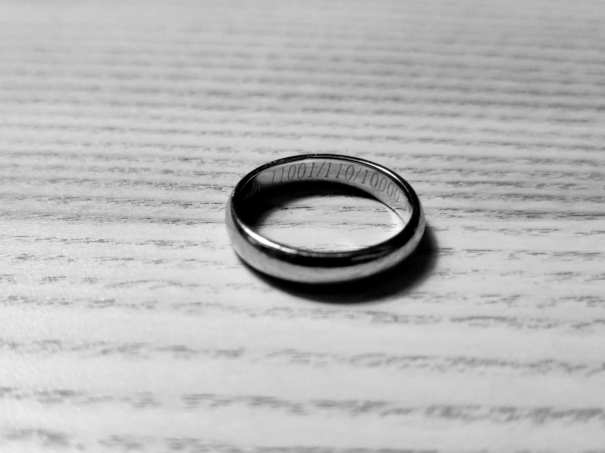

Title: 指輪
Language: japanese

これは日本語で初めて書く。毎日少し日本語を書きみたい。

今は午後8時53分だ。今日は長い月曜日だった。

朝は日本語の授業で始まった。よかった、今日は頭が遅すぎなかった。仕事について、何もおもしおい起こた。それはいいニュース。

ただし、仕事の後ジムで悪い物が起きた。結婚指輪は殆ど無くした。のを脱いで、床で置いて、忘れた。うちに変えった時、気がついた。凄く運がいかった、ジェスさんと洋子さんは手伝った。洋子さんはジムにいって、のを見つけた。

今は午後9時35分だ。日本語の書きのが、めっちゃ遅いだ。😅

おやすみなさい。

