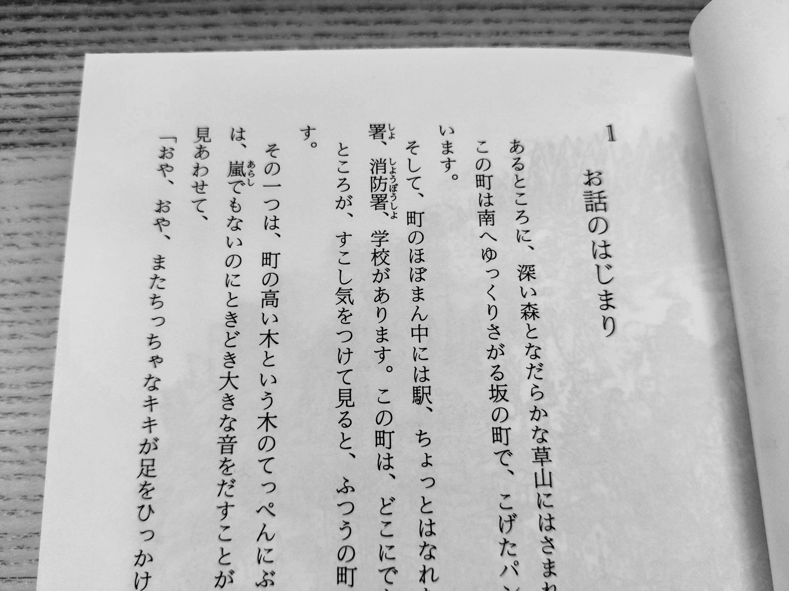

Title: 目標
Language: japanese

私の目標について話そう。特に、日本語学習について話そう。

七月前に東京に来た、今まで日本語の授業があっている。私は多い習ったと思うけど、めっちゃもっと習いたい。

日本語でマンガや、アニメや、小説が楽しみたい。

例えば、2023年終わり前”[魔女の宅急便](https://www.goodreads.com/book/show/509760._Majo_no_Takkyuubin_)”を読めたら、凄く嬉しいだ。これは今年の目標だと思う。

頑張る。

