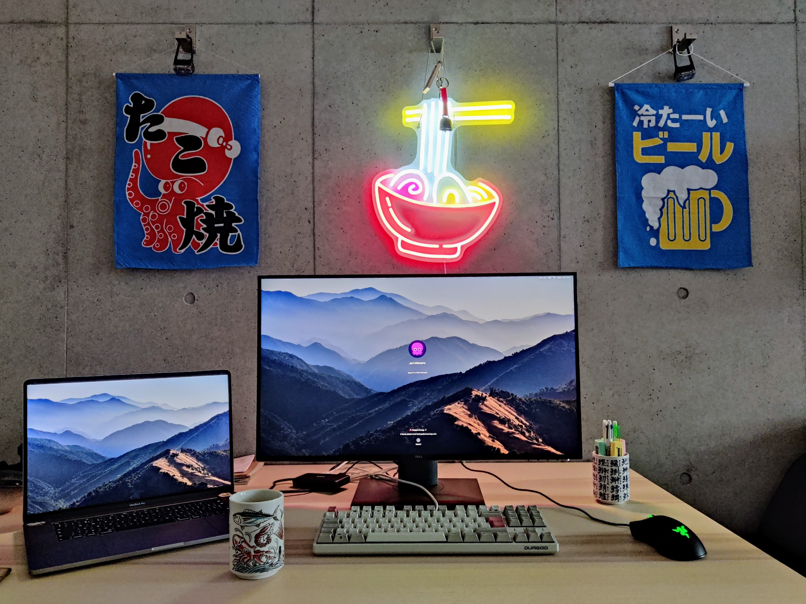

Title: 家で働く
Language: japanese

今日は家で働っていた。家でほとんど働かないけど、できるのは今週が最後だ。今週の週末妻は日本に来るので、これから彼女は家の机を使う。

天気はよかったから、アリさんと一緒に代々木公園で走った。そして、近くの蕎麦屋に食べに行った。僕はうどんとカツ丼食べて、随分美味しかった。もう一度戻る。

明日は事務所で働く。家で働くのが素敵だけど、同僚に会うのが好きだ。

これは私達の机 🐙🍜🍺

これは今日の昼ご飯 🤤🤤🤤

