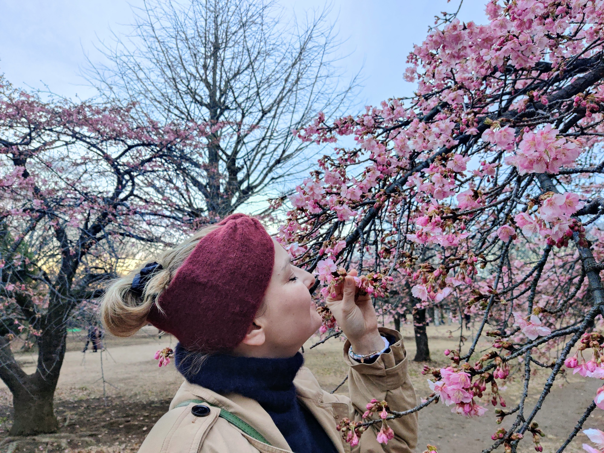

Title: ゆっくり日曜日
Language: japanese

今日はとてもゆっくり日だった。マグダ(妻)がジェットラグあるし、私達は遅く起きった。

僕は今朝代々木公園に走に行ったけど、怠惰に感じたから、行きたくなかった。行ったのが嬉しい。

それから、私達は寿司改善に食べに行った。楽しかった。😊

帰る前に、代々木公園にロカビリーのダンサーを見に行った。毎日曜日彼らは代々木公園に踊りに行って、時々私達は見に行く。

🌸

<iframe width="560" height="315" src="https://www.youtube.com/embed/gbIQvY0hYGE" title="YouTube video player" frameborder="0" allow="accelerometer; autoplay; clipboard-write; encrypted-media; gyroscope; picture-in-picture; web-share" allowfullscreen></iframe>