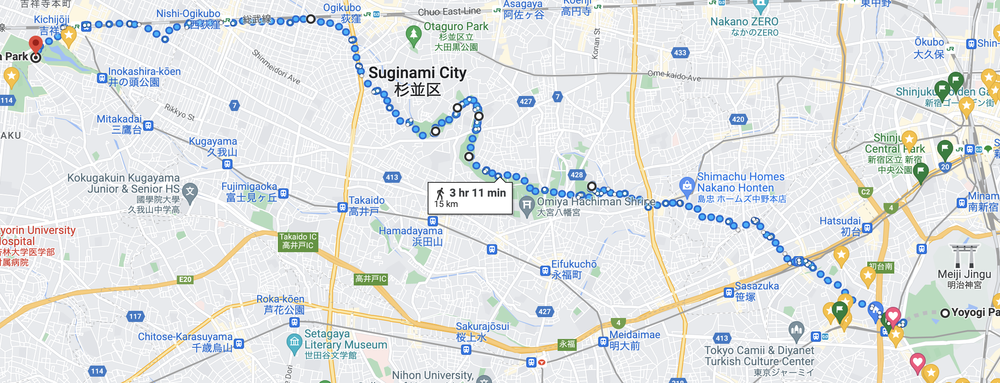

Title: 週末の予定
Language: japanese

久しぶり!

今週忙しかったので、日記で書けらなかった。次の日達には頑張る。🙇

火曜日の朝に渋谷区役所に妻の登記を変りに行った。始めて翻訳家を要らなかったのが嬉しかった。🙂

水曜日に仕事にパーティーがあったし、のはオクトパスエナジーがの十万客様についてだった。パーティーは飲み物や食べ物やゲームあった。仕事の後、同僚達に話しするのが凄かった。

今日はゆっくりだった、何も面白い起きた。

今週の土曜日に妻と一緒に長い散歩したい、代々木公園から井の頭恩賜公園まで。天気がいいそうだけど、散歩が長すぎるかもしれないので。私達は行ったながら疲れたら、電車で終わると思う。

マリオカート

ジェンガ

今週の土曜日の散歩