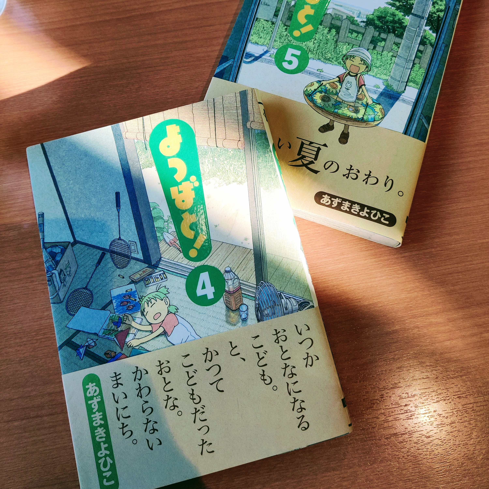
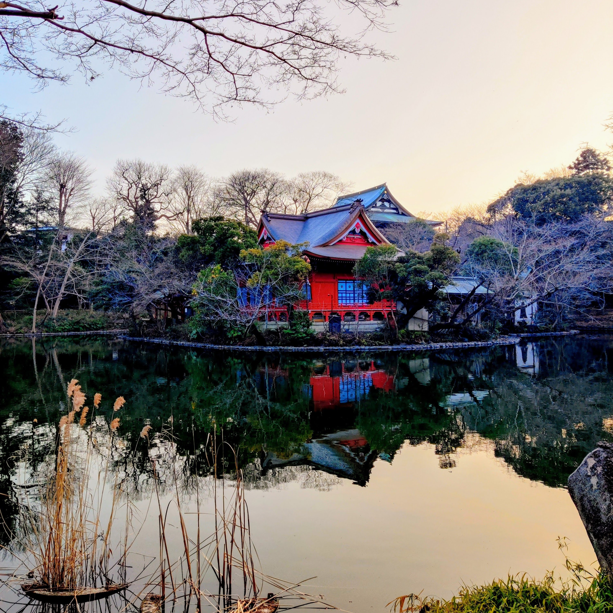

Title: 長い散歩
Language: japanese

先週の金曜日には、何をやったがわすれった。

但し、私達は土曜日に長い散歩しに行った。私達は代々木公園から井の頭公園まで行った、15キロぐらいな散歩だった。井の頭公園は恐らく2番好きな公園だ。

代々木公園と井の頭公園間に、数回寄った。

先ず、大宮八幡宮に寄った。きれいな神社だ。お祈りして、近くのでお菓子を食べた。妻は初めてでお祈りした。川の隣に歩いて続いた。

それから、凄いBOOK-OFFを見つけた。そこで多いほぼ新しくて、安い本があった。[よつば](https://dengekidaioh.jp/product/yotsubato/)の本を2冊を買った。

小さい昼ご飯を食べて、井の頭公園に達した。天気はきれいだて、素敵だそうな写真を撮った。

散歩と日長いだったから、電車で帰った。

大宮八幡宮

**[よつばと!](https://dengekidaioh.jp/product/yotsubato/)**

井の頭公園

井の頭公園