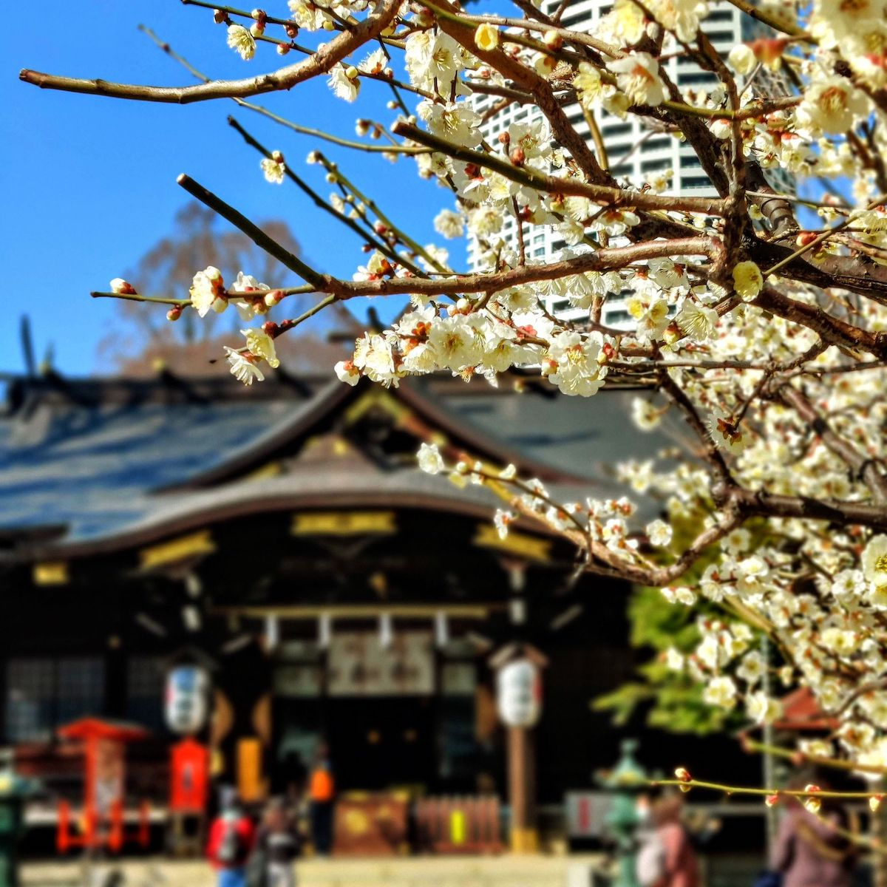
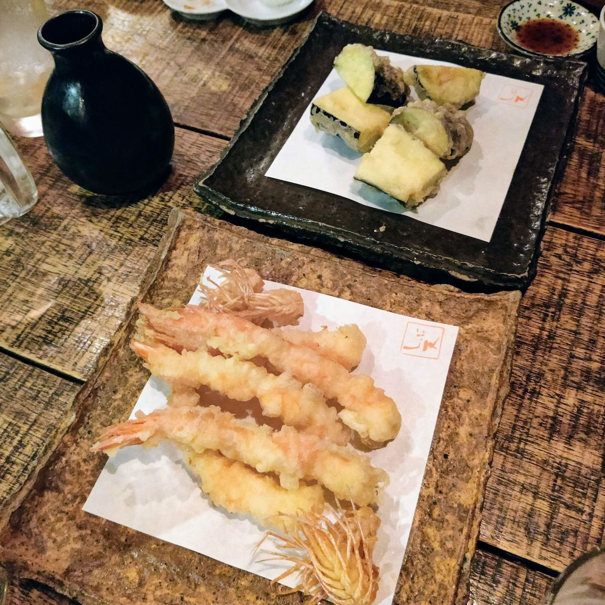
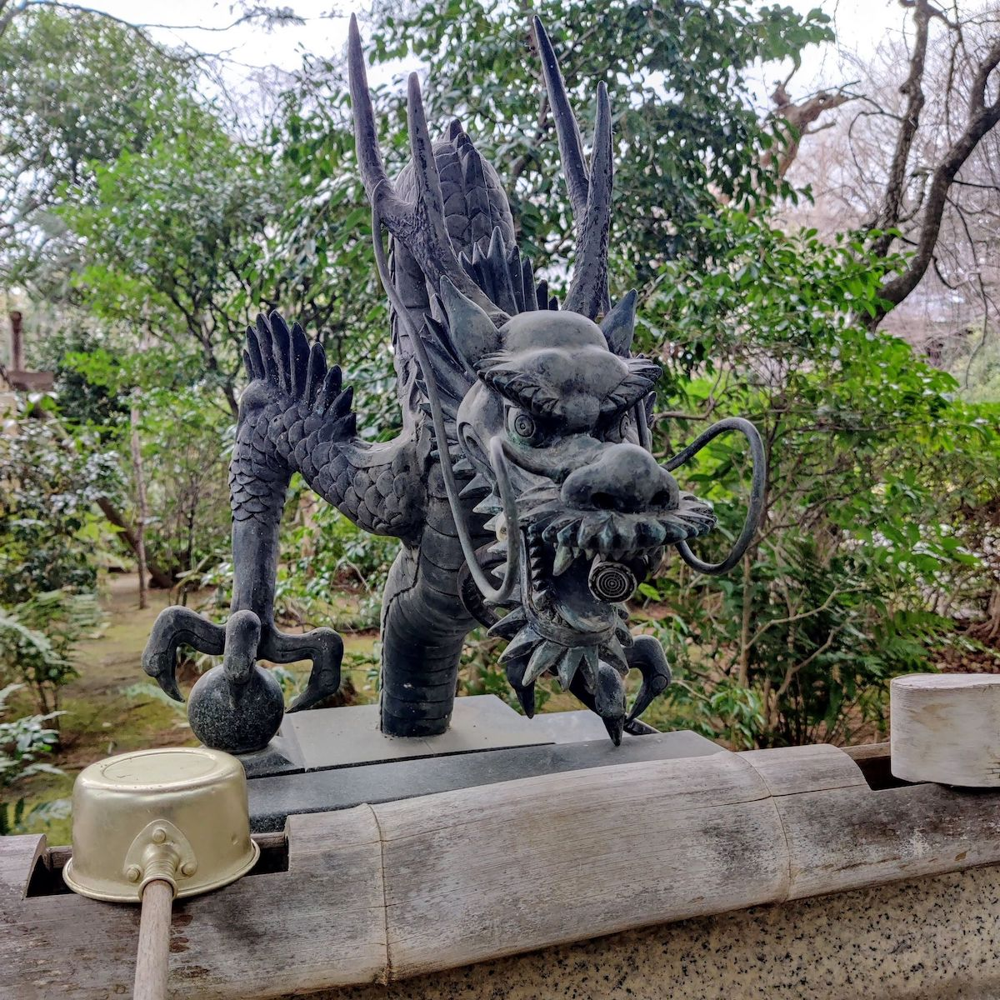
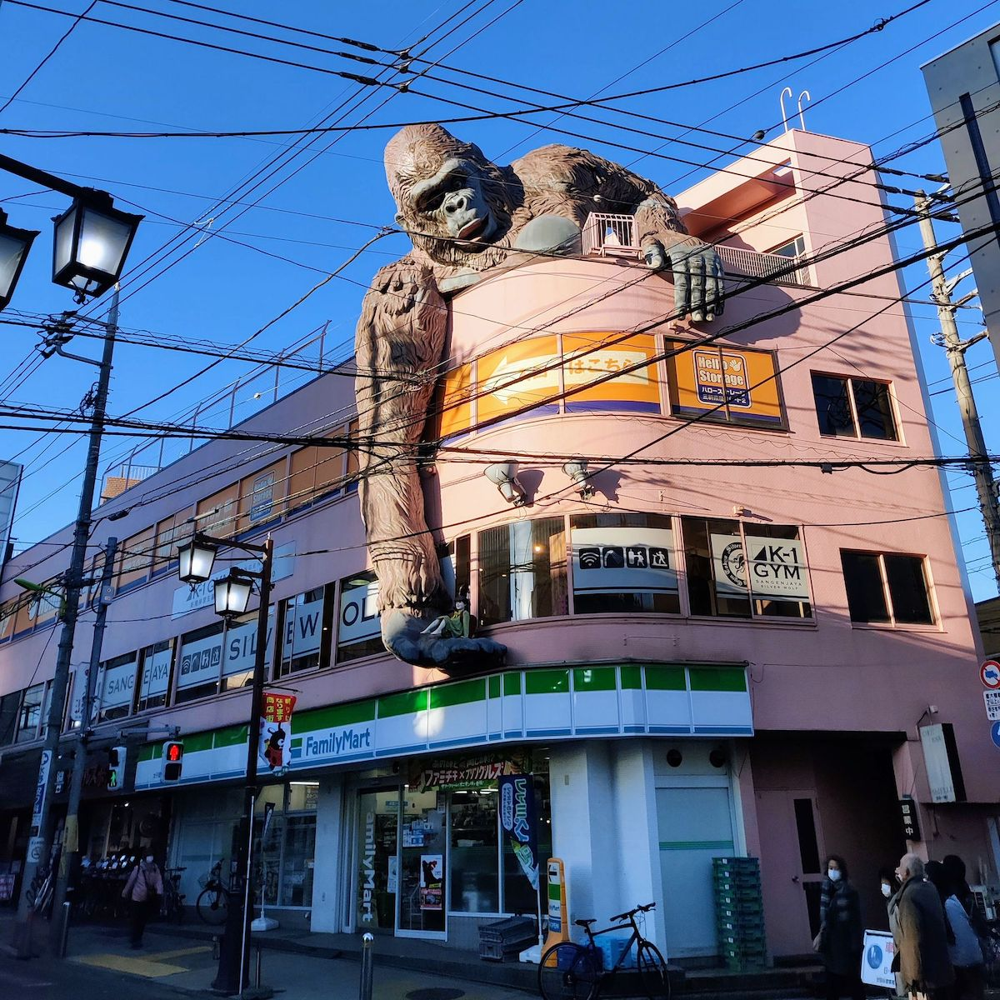

Title: 長い週末
Language: japanese

僕は随分怠け者だ。「毎日、日記に書くよ！」と言ったんだけど、あまり書いていない。

ともかく、先週は凄く短かった。僕はだけ月曜日から水曜日まで働いた。
## 木曜日

凄くゆっくり朝だった。天気は良かったので、私達は木曜日に新宿のあたりに散歩した。

それから、インドのレストランで昼ごはんを食べた。美味しかった。🤤

## 金曜日

今年たくさん休みが掛からなかったから、金曜日に休んだ。

天気は良くなかったので、私達は家でゴロゴロした。

でも、よる友達と晩御飯食べにあった。天ぷらを食て、お酒を飲んだ。🤤

## 土曜日

私達は長い散歩した。今度、代々木公園から小園児まで歩いた。

寒すぎたけど、少しお寺達に見によった。

## 日曜日

昨日もゆっくりだったけど、天気はきれいだった。

私達はまた長い散歩したくなかったから、三軒茶屋に歩いた。住んでいるところから遠くない。

昨日は長い週末から完全な終わりだった。

