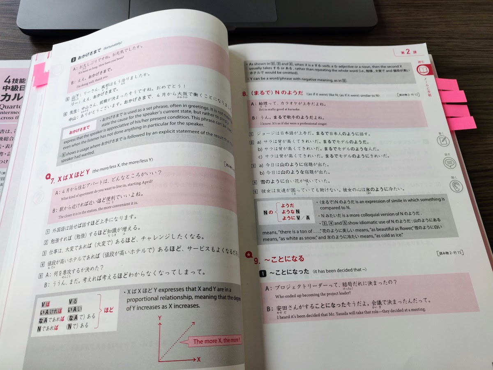

Title: 文法の練習、ぞの１
Language: japanese

Quartetの教科書の文法の練習する**ためには**、時々こちらみたいな短いポストを書く**ことにします**。

この教科書はたくさんの文法がありますから、僕はよく練習するのを**始めしていかなきゃ**。

文法の練習**すればするほど**、易しくなります。

例えば、このポストは四つ句**しかありません**けれど、五つも文法のポイントを練習できました。（すごくないね、次回頑張る）

とにかく、仕事の時間です。

またね。

