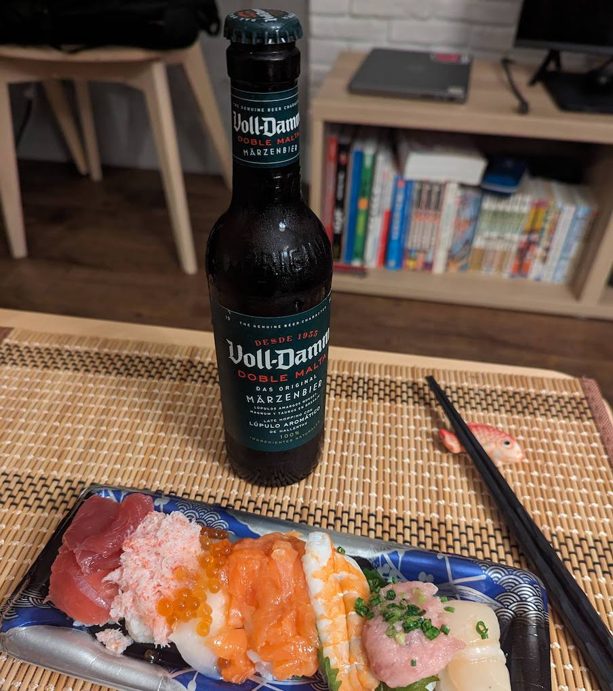

Title: 文法の練習、ぞの２
Language: japanese

今朝起きました時、すごく疲れていました。昨晩の大きい晩御飯の**ため**、よく眠れなかった。

夜にたくさん食べる**べきではない**知っているけど、奥様はJLPTN4の成績を祝うために、特別ビールと寿司を買ってくれました。

**何と言っても**、このビールが大好きと割りに合いました。

しかし、N4の試験受かった**からといって**、豚**として**食べる**とは限りません**。

