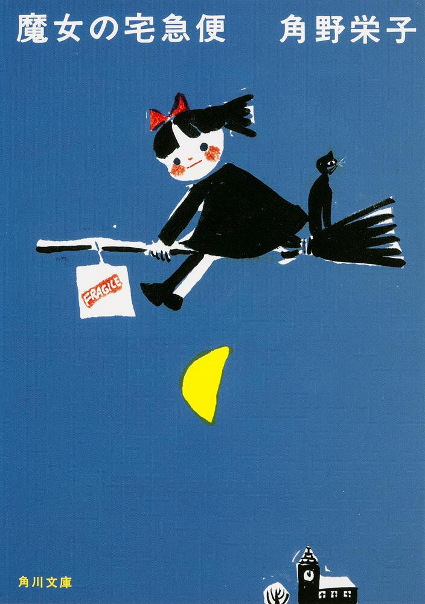

Title: 赤ちゃんがいます
Language: japanese

赤ちゃんはAda Matilda Manzano-Ollerと言いますけど、私たちは赤ちゃんに**アダちゃん**というです。

アダちゃんは二十日九月に生まれました。

アダちゃんが生まれて以来、趣味の時間がなくなりました。

しかし、もっと一つことをするのは、日本語で本を読むです。

十月中に「[R・L・スタイン](https://www.wikiwand.com/ja/R%E3%83%BBL%E3%83%BB%E3%82%B9%E3%82%BF%E3%82%A4%E3%83%B3)」の「[グースバンプス](https://www.wikiwand.com/ja/%E3%82%B0%E3%83%BC%E3%82%B9%E3%83%90%E3%83%B3%E3%83%97%E3%82%B9)：死の館へようこそ」の本を読みしました。日本語で小説を読めるのは感じがすごく良かった。すごく嬉しかったです。

それから他の本を読みしまったのは「[ふしぎ駄菓子屋 銭天堂](https://www.kaiseisha.co.jp/special/zenitendo/series/)：１」です。この本は小説じゃなくて、短い話の本です。本は六つ話があると、全ての話はふしぎなトピックがあります。

今他の小説を読んでいます、「[魔女の宅急便](https://www.kadokawa.co.jp/product/321502000242/)」と言います。ジブリの「[魔女の宅急便](https://www.ghibli.jp/works/majo/)」が私の一番好きなジブリの映画ですから、本当にこの本を読めたい。この本が私に読みにくすぎると読めない漢字たくさんがありますけど、私の勉強にいいです。

