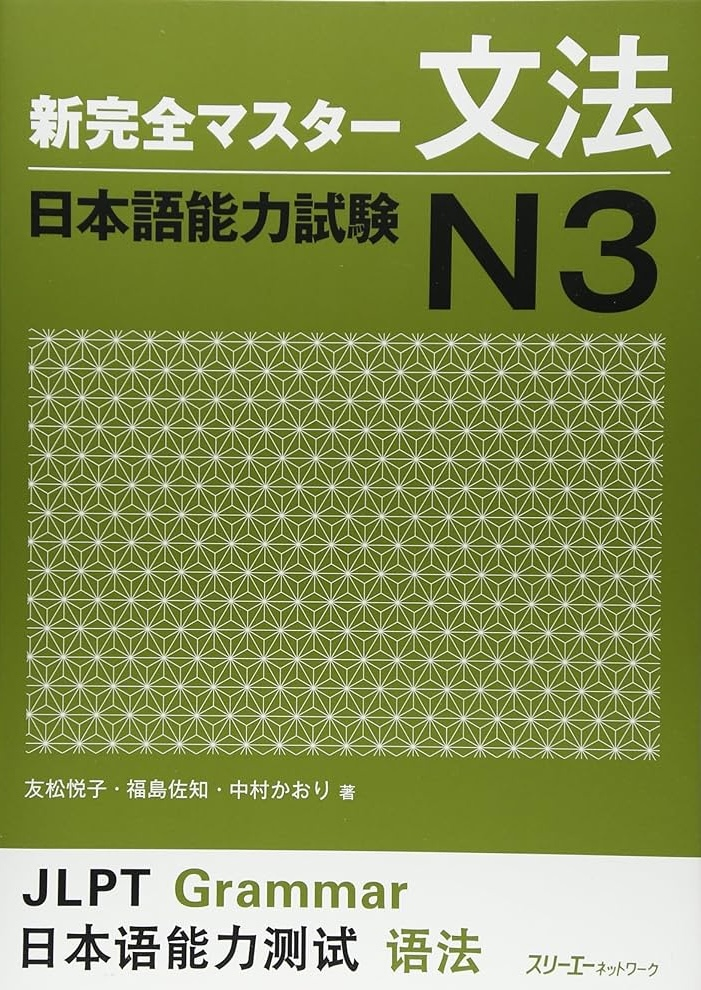

Title: 日本語能力試験について
Language: japanese

おはようございます皆さん、元気ですか。

今日は日本語能力試験について書きたい。

去年の夏に本語能力試験N4を受けて、合格しました。めっちゃ嬉しかった。しかし、たくさん勉強の時間をかかりました。

今年の夏に日本語能力試験N3を受けたかった、でも勉強のために時間が足りないと思います。N4はN3に比べてちょっと初心者の事件です。特に文法について、N4すごくより難しいですと思います。

最近もっと勉強してみています、でもゆっくり緊張になっていますと日本語の勉強が楽しいべきだ。

だから、文法と単語の勉強を遅くなって、N3の試験をまだ受けるようにしません。将来のを受けるかもしれません、けど今年受けない。

以上です。ここにもっと書いたほうがいい。

