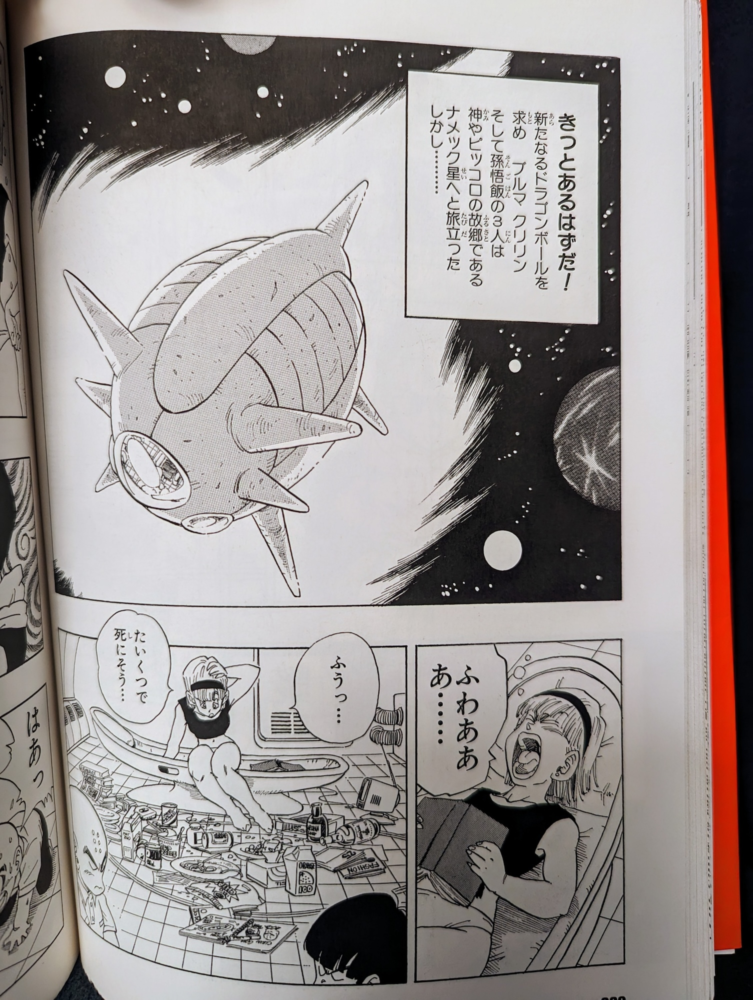
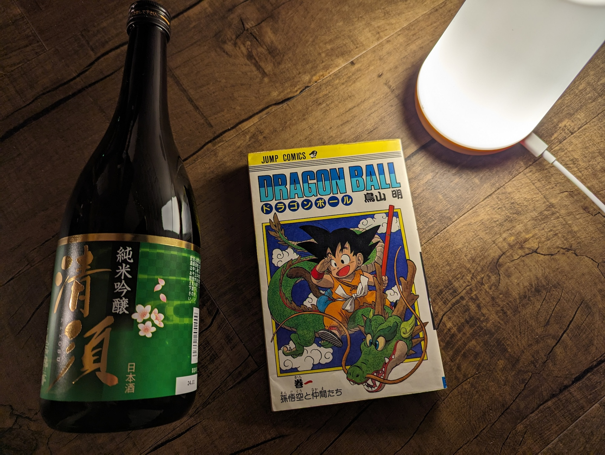

Title: 鳥山明について
Language: japanese

鳥山先生おかげで、コミックスと漫画が興味がありました。子供の頃、お母さんにスペイン語で生まれた初めてコミックスを買ってもらったのは、ドラゴンボールのコミックスてした。わしは六歳くらいだったと思います。

この日以来、何度もずっとドラゴンボールを読んだのが、わからない。多数回ですね。まず、スペイン語で数回のを読んで、数年前英語でまたずっとを読みました。

数月前、日本語で読み始めて、わかることできるのがめっちゃ嬉しかった。ゆっくりよんでいますけど、すごく楽しんでいます。

鳥山先生、ありがとうございました。

  

