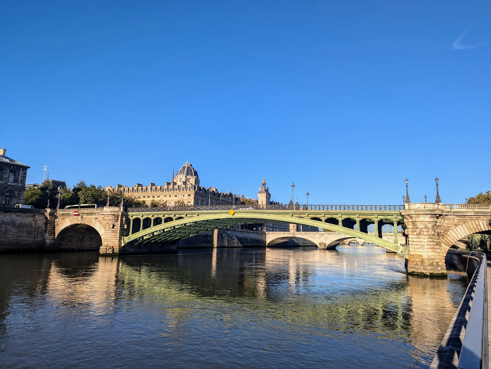

Title: 新しい生活
Language: japanese

前回のブログポストを書いたのが長い時間でした。今回は口実がない。ちょっと怠け者でした。

ニッヶ月前に、パリに引っ越しました。先週まで一人暮らしで住んでいた、木曜日に妻と娘はパリに到頭来ました。

今まで、パリはすごいでした。食べ物や新しい同僚や良かった。まだ日本の生活を慕っていますけど、ゆっくり新しい生活に慣れています。

フランス語を勉強を始めましたのに、日本語ほど興味がない。理由が知らない、不思議なことです。多分漫画を読むのが好きになりすぎました。

週末にも走り始めました。僕のアパートから、セーヌ川が近くですので、セーヌ川並んで走ります。代々木公園で走るのが大好きでしたけど、セーヌ川の隣はすごいです。

