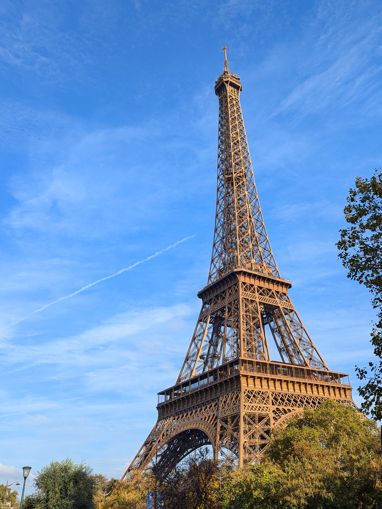

Title: パリの普通の週末
Language: japanese

この週末は妻と義理お母さんにパリを案内しました、特にエッフェル塔のを。

土曜日に昼ご飯のあとで、セーヌ川に連れて行きました。天気が良かったのでエッフェル塔にセーヌ川伝いにいい散歩しました。

エッフェル塔近づきながら、多い人がいました。もしかしたら、土曜日にこの辺に行くのが悪い意見だろうと思っています。

それから、アダちゃんが寝入りましたからパリの道通いて帰り始めました。起きました時地下鉄に乗りて帰りました。

日曜日は別に何もしませんでした。午前に僕はアダちゃんを世話しながら、妻と義理のお母さんは商店街に行きました。彼女らはローストチキンを買って、昼ごはんに食べました。後で、アリさんとジェスさんが私達を訪ねて、コーヒーと甘い物を食べました。

いい週末でしたが、あまり趣味の時間がありませんでした。

