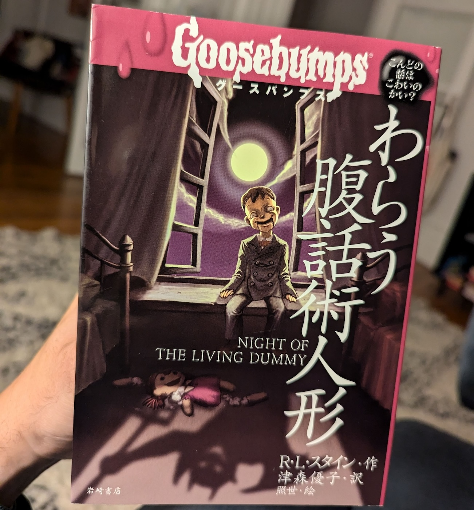
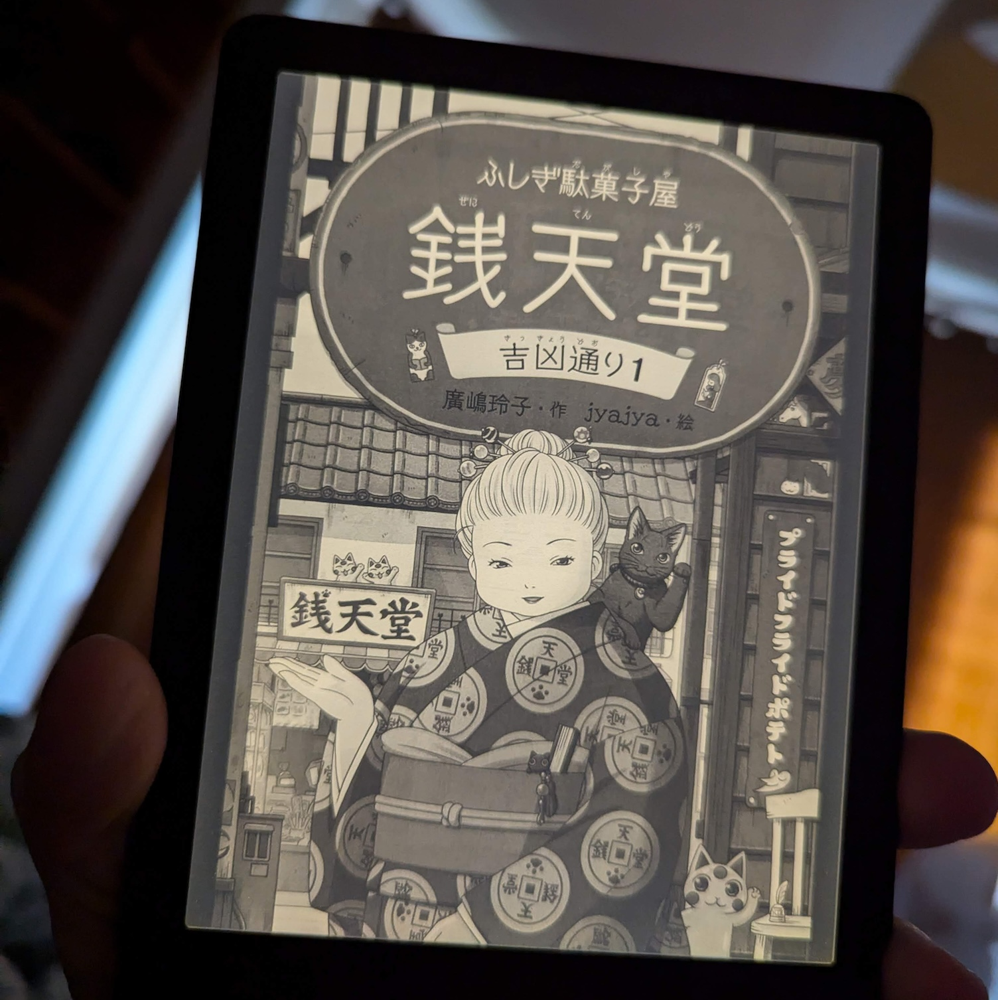
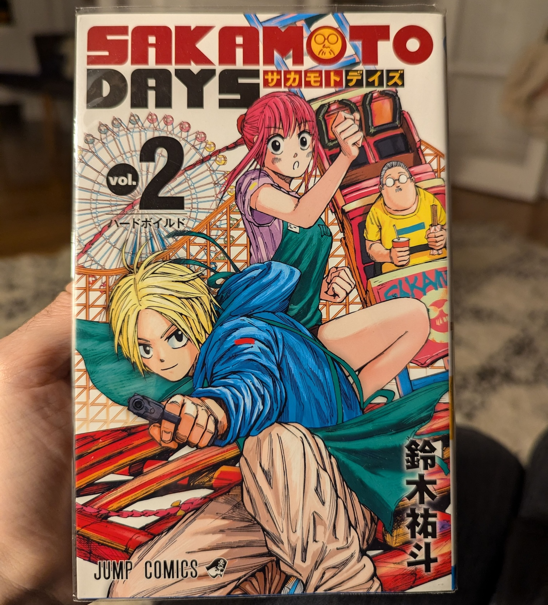
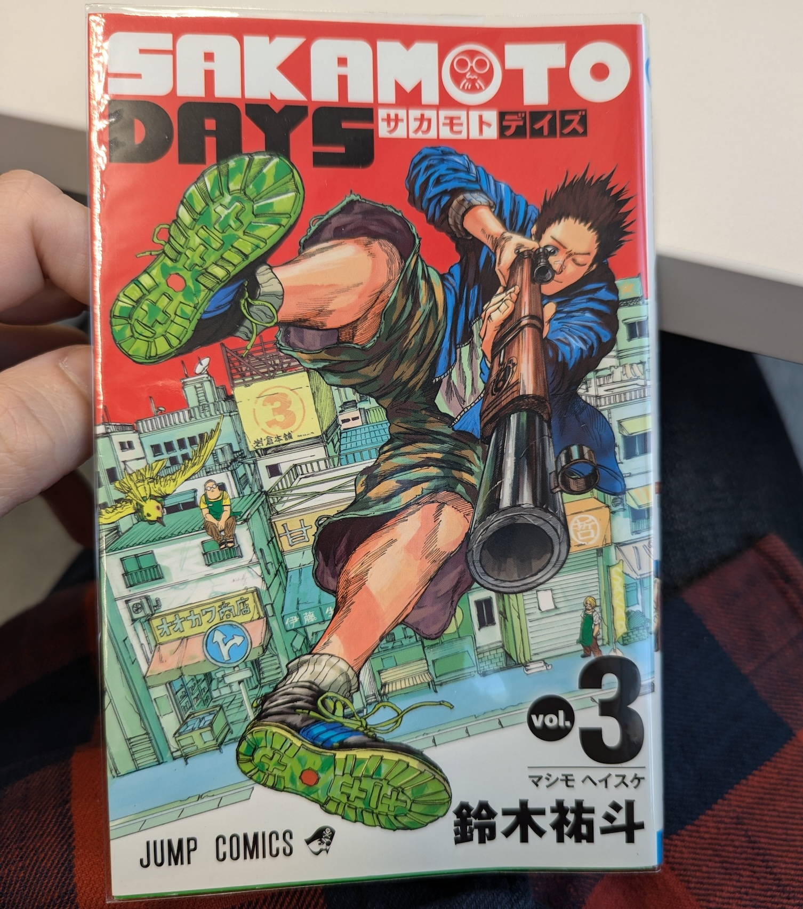

Title: 読書について
Language: japanese

この週は風邪を引きました。先週末に喉が痛み始めて、火曜日からせきが出てきました。体が痛くなかったので、インフルエンザではなかったと思います。それで、この二週間、走れませんでした。今日から、元気が出てきました。

走ることができませんでしたので、もっと読む時間がありました。木曜日にハロウィンチャレンジの本を読み終わりました。本はグースバンプスの本です。タイトルは「[わらう腹話術人形](https://www.iwasakishoten.co.jp/book/b191878.html)」です。去年も同じシリーズの本を読みました、けど本を読み終えるのに多くの時間が掛かりました。この本を読み終わった時、とても気持ち良かった。

次の本はすでに読み始めています。タイトルは「[ふしぎ駄菓子屋銭天堂、吉凶通り1](https://www.kaiseisha.co.jp/books/9784036358700)」。この本は「[ふしぎ駄菓子屋銭天堂](https://www.kaiseisha.co.jp/special/zenitendo/)」のシリーズの中で、第２１巻です。もう第一巻と第二巻を読みましたが、この本では新しい物語が始まったので、僕は読んでみたかった。

それに、漫画も読んでいます。最近スラムダンクを読み終わって、別のシリーズを読み始めました。タイトルは「[サカモトデイズ](https://sakamotodays.jp/)」で、とても楽しいです。テーマは元暗殺者の坂本が他の暗殺者から家族と家族のコンビニを守るというものです。今日第二巻を終わって、第二巻を始めました。「スラムダンク」に比べて「サカモトデイズ」のほうが読みにくいが、もっと単語を覚えられます。

明日は日本からたくさん引っ越しの箱を受け取るはずで、家で忙しい週です。

