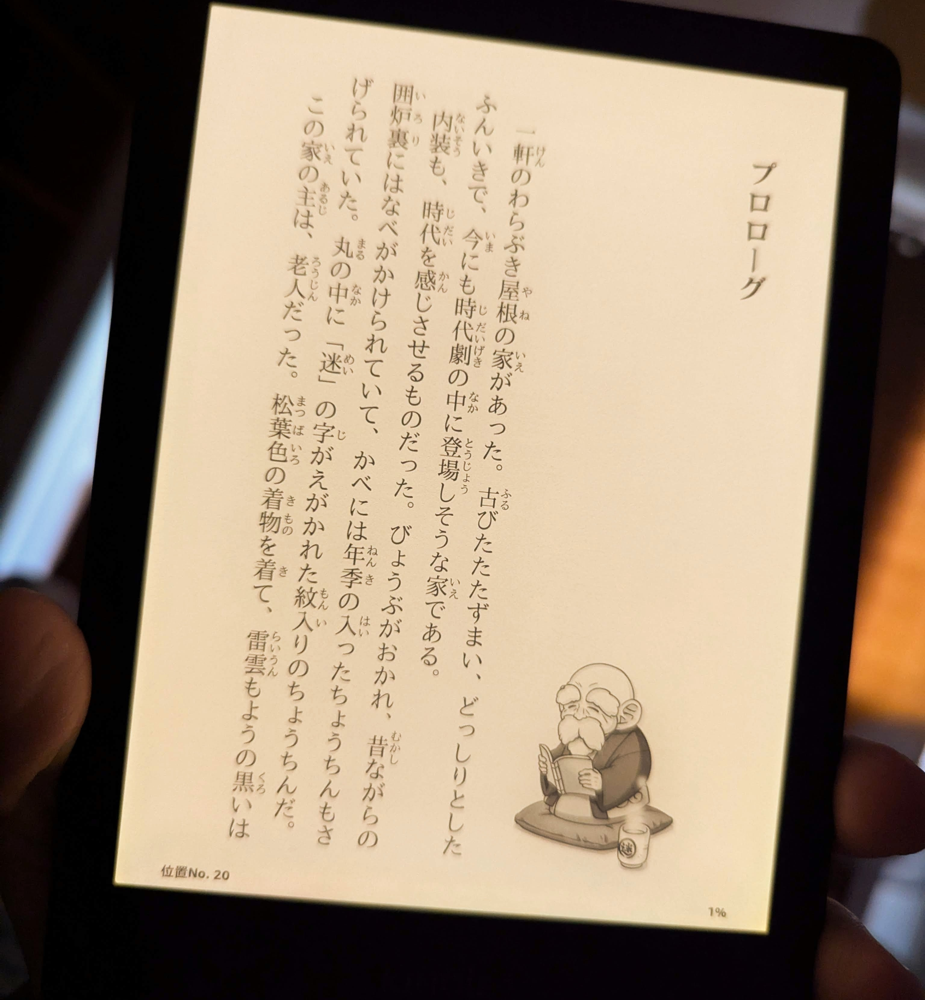

Title: 電子ブックリーダーについて
Language: japanese

僕はテクノロジーが好きです。読書も好きです。だから、二つのことを合わせるのは不思議じゃないです。

最初の給料をもらったとき、電子ブックリーダーを買いました。それはキンドルでした。あの時にはキンドルがまだ新技術でしたが、それを買えたのがめっちゃ嬉しかった。

僕は機器の電子インクに感動した。この頃キンドルの画面には光がなかったので、それを読むのが、紙の本を読むようでした。

それ以来、新しいキンドルを買いました。このキンドルは画面が光があって、光の色が暖かいです。毎晩、寝る前にベッドで僕の家族に迷惑をかけないで、読める。

本当にすごい機器です。

