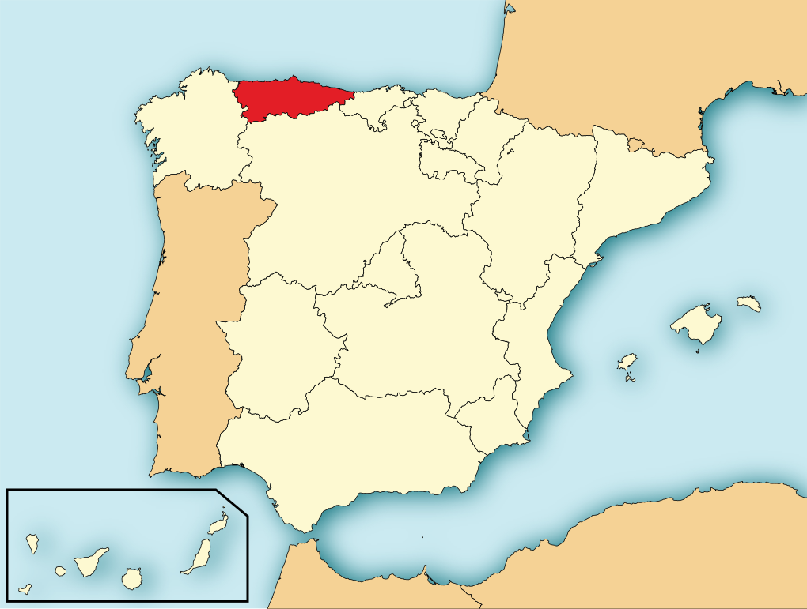
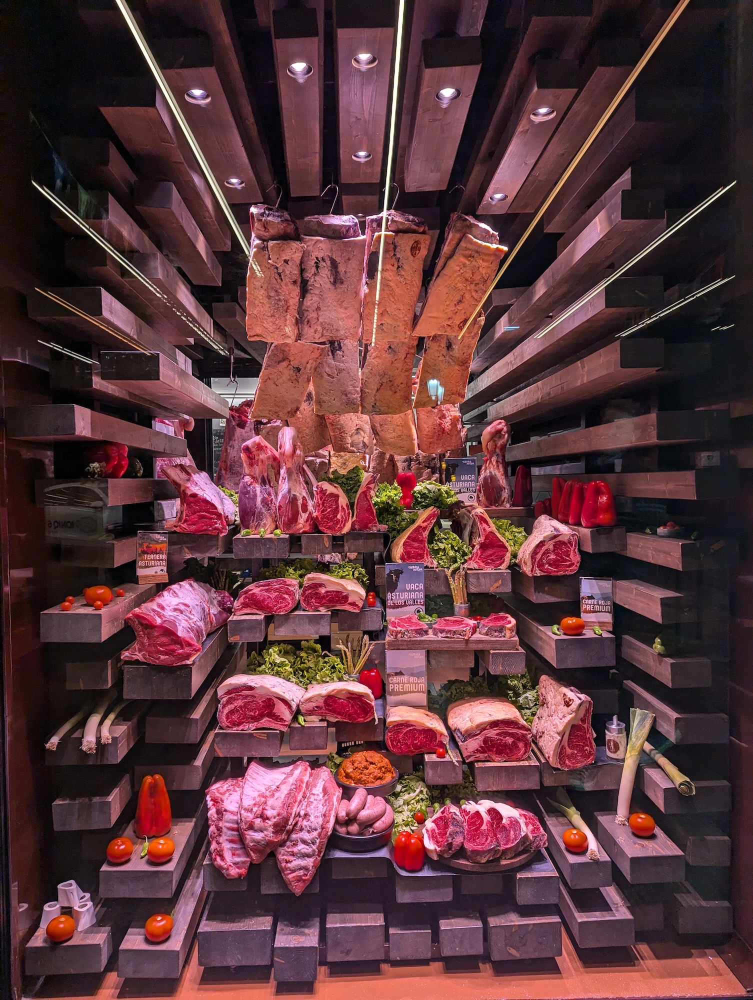
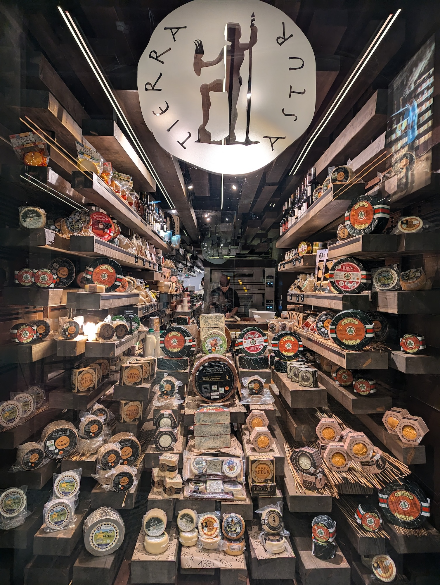

Title: オビエドについて
Language: japanese

2週間前オビエドに出張しました。理由は今会社と<ruby>共<rt>きょう</rt></ruby><ruby>同<rt>どう</rt></ruby>しているの本社が、オビエドであります。オビエドはスペイン北側のアストゥリアス州の中で、小さいな町です。私の町に比べてが似てます。

火曜日にこの会社が素晴らしいレストランに私たちを連れてきて、すごく美味しく飯してくれました。このレストラんの名物はりんご酒です。水曜日にたくさん会議がありましたので、少しいだけ飲みました。

水曜日と木曜日は忙しくて、あまり自由な時間がなかった。しかし、夕方に同僚と一緒に遊びました。仕事の後、バルに行って、晩ご飯を食べました。

もうオビエドに行くことは知らないが、次回は家族を連れていきたくて、アストゥリアス州を観光したい。

アストゥリアス州：

この写真はレストラン玄関です：

