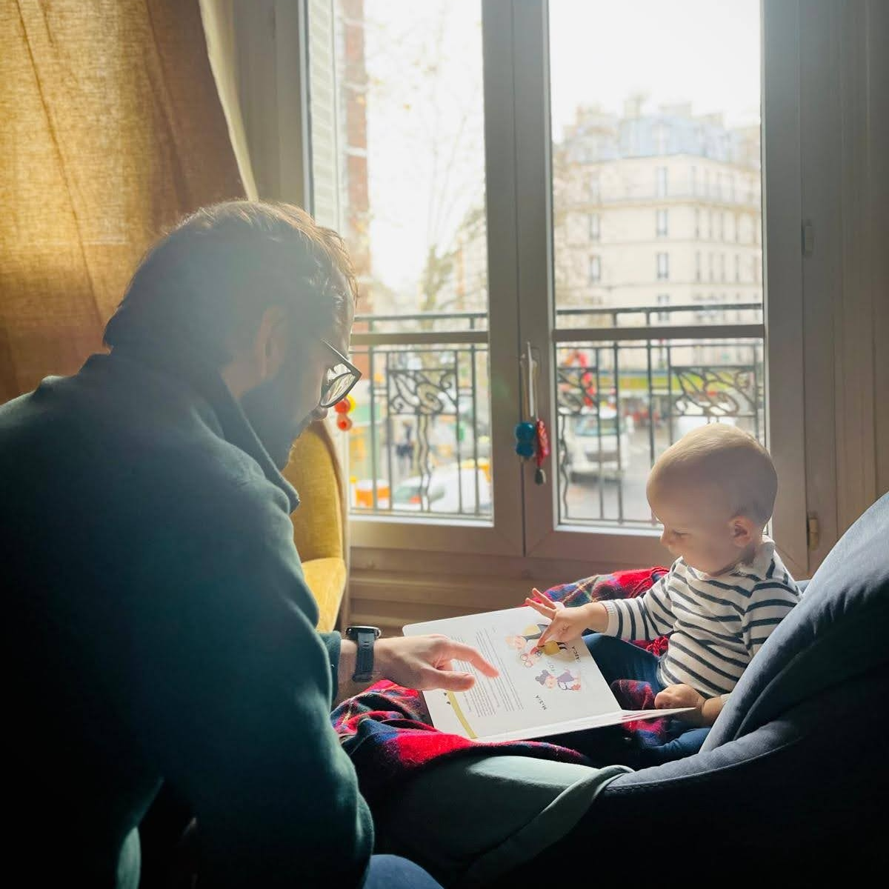

Title: 幼児について
Language: japanese

最近僕の娘は幼児になりました。

それはどういう意味ですか？

歩くとか、ちんぷんかんぷんな言葉を話すとか、どこでもおもちゃを隠すとかだと思います。それはすごく楽しいですけど、別の意味もある：色々な意見を持ち始めました。例えば、彼女が何かを握る時、その物が世界の中で一番欲しい物になります。おもちゃなら大丈夫ですけど、ガラスはよくない。

アダちゃんはもう本に興味を持ち始めました。それが僕は嬉しくなります。最初、驚きました。しかし、僕は家にたくさん本があって、いつも本を読んでいるので、多分当然な反応です。彼女はたくさん子供の本を持っています。僕たちは本棚を共有しています。毎朝起きる時、アダちゃんが本棚に行って、次々本棚から全部の本を出します。本と一緒に僕のソファに座るのも好きです。:)

