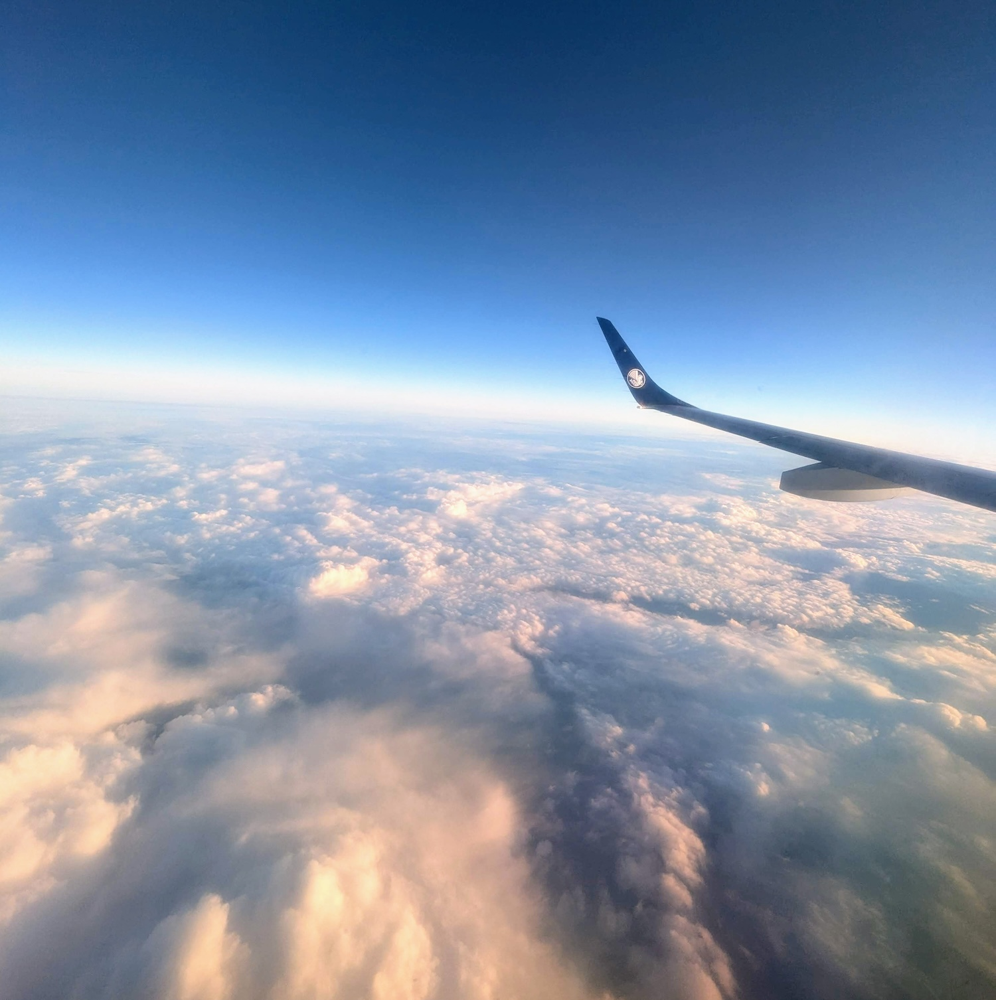

Title: 幼児との飛行機旅行について
Language: japanese

一週間前に妻と娘とスペインに来ました。パリから僕の出身地まで飛行機で１時間３０分ぐらいしかかからないので、大変じゃなかった。しかしながら、最近娘は歩き始めて以来、全くじっとできない。

離陸直後に妻はアダちゃんを連れていて、食べ物をやったり、一緒に遊んだりしました。あとで、僕は飛行機の後ろにアダちゃんを連れて行って、窓から景色を見せました。意外にもアダちゃんは眠り込みました。良かった。

それから、僕は赤ワインを楽しみました。

