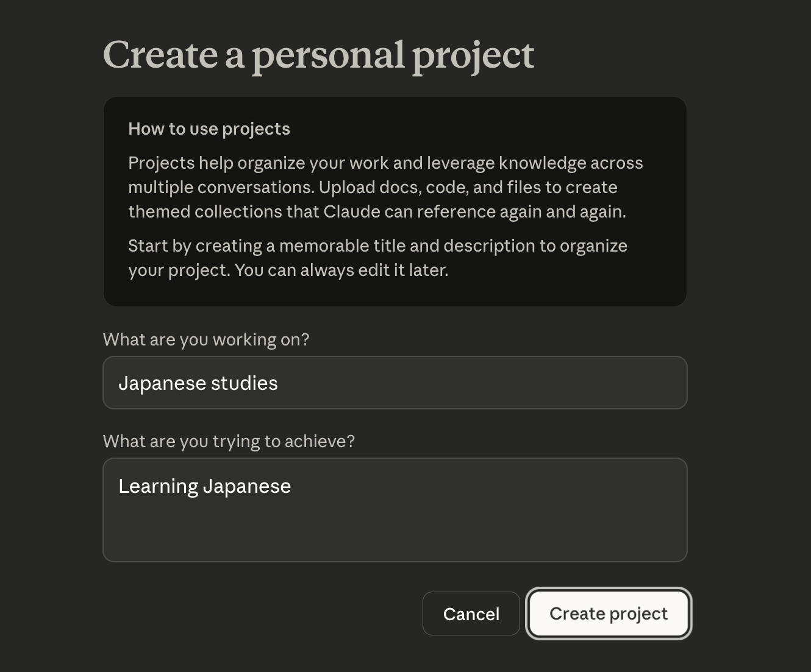
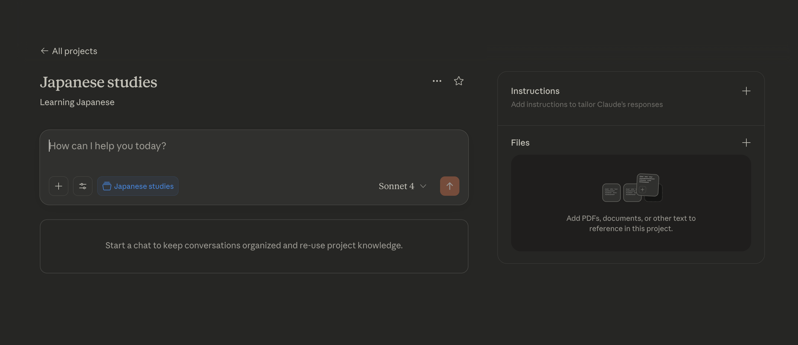
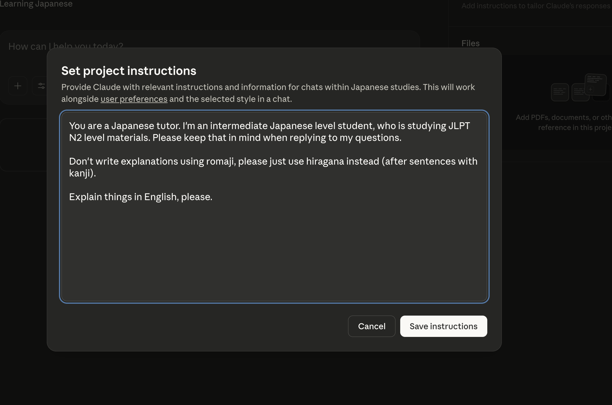

Title: Using AI to study Japanese
Date: 2025-09-29

I've recently started studying JLPT N2 level materials. Most of my study is self-directed, without a teacher supervising me. While I do have weekly Japanese lessons where I can ask questions about grammar points or vocabulary, I face two challenges:
- I often forget to ask about things that I struggled with during self-study
- More importantly, I'm not patient enough to wait until my next lesson to get my questions answered

Previously, I would simply Google my questions and consistently find good answers and examples. While this method works well, the constant context switching between study materials and various browser searches can be disruptive to the learning flow.

What if you could simply ask these questions to an AI assistant and receive instant, detailed answers with examples, plus the ability to ask unlimited follow-up questions? Essentially, what if you had a personal Japanese tutor available 24/7?

I'm certainly not the first person to think of this—I actually tried this approach a couple of years ago when ChatGPT 3.5 launched. The results were decent but not exceptional, and the free-tier limitations were restrictive. However, things have dramatically improved since then.

Both ChatGPT and Claude now offer incredibly generous free tiers, and the quality has dramatically improved. You can easily create a "project" in your AI tool of choice with custom instructions that persist across sessions—eliminating the need to repeat context and allowing you to dive straight into learning discussions.

Today I want to share how I'm using Claude to enhance my Japanese studies (though this approach would work equally well with ChatGPT).

# Setting up a Japanese tutor in Claude

First of all, you'll need to register for a free account at [Claude](https://claude.ai) or ChatGPT. Once you have an account, you should be able to see a section in the sidebar that says "Projects". Click on it, to get to the following page:

Then, you'll end up in a screen like the one below:

Now it's time to set some base instructions for Claude to follow in this project. Click on the top right Instructions panel to set them up: 

Then all you have to do is start a new conversation in this project. For instance, here's the last grammar point I've been studying:

> Can you explain the を問わず grammar point? I'm particularly interested in the "anytime / anywhere / anyone" meaning

And Claude's answer:

---

## を問わず (をとわず) - "Regardless of Anytime / Anywhere / Anyone"

### Formation

- Noun + を問わず
- Question word + を問わず (いつでも、どこでも、だれでも become いつを問わず、どこを問わず、だれを問わず)
- Noun1 + Noun2 + を問わず (opposing pairs)

### Meaning

This expresses that something applies regardless of the condition mentioned. When used with question words (いつ、どこ、だれ、何), it creates the meaning of "anytime," "anywhere," "anyone," or "anything."

### Examples with question words (anytime/anywhere/anyone)

1. いつを問わず、ご連絡ください。
   (いつをとわず、ごれんらくください。)
   "Please contact us anytime." (literally: regardless of when)

2. どこを問わず、この商品は人気です。
   (どこをとわず、このしょうひんはにんきです。)
   "This product is popular anywhere." (literally: regardless of where)

3. だれを問わず、平等に扱います。
   (だれをとわず、びょうどうにあつかいます。)
   "We treat everyone equally." (literally: regardless of who)

### Examples with nouns

4. 性別を問わず、応募できます。
   (せいべつをとわず、おうぼできます。)
   "You can apply regardless of gender."

5. 昼夜を問わず、働いています。
   (ちゅうやをとわず、はたらいています。)
   "I work day and night." (literally: regardless of day or night)

6. 国内国外を問わず、配送可能です。
   (こくないこくがいをとわず、はいそうかのうです。)
   "Delivery is possible both domestically and internationally."

### Key points
- 
- Formal expression, similar to にかかわらず
- Often used with opposing pairs (昼夜、男女、老若、etc.)
- を問わず slightly emphasizes "not asking/not questioning" the condition
- Very common in business and formal contexts
- When used with question words, it creates convenient expressions for "anytime/anywhere/anyone"

This grammar point is especially useful for expressing inclusivity or unlimited conditions!

---

As you can see, this is a very detailed explanation, with multiple examples and notes. I can then ask follow-up questions, such as:

> Would you say いつでもいい、なんでもいい、どこでもいい could be the equivalent casual expressions of いつを問わず、何を問わず、どこを問わず?

And then Claude would point out how wrong I am:

---

That's a great question, but I'd say they're not quite equivalent - there's an important nuance difference!

### いつでもいい、なんでもいい、どこでもいい

These mean "any time is fine", "anything is fine", "anywhere is fine" - they express that **you have no preference** or that **you're flexible/indifferent** about the choice.

Example:

- A: いつ会いましょうか。(When shall we meet?)
- B: いつでもいいよ。(Anytime is fine with me.)

### いつを問わず、何を問わず、どこを問わず

These mean something is true or applicable **in all cases** or **under any circumstances** - regardless of time/thing/place. It's not about having no preference, but about **universality** or **no restrictions**.

Example:

- この店はいつを問わず混んでいる。(This restaurant is crowded at all times / regardless of when you go.)

### Better casual equivalents would be

- いつを問わず → いつでも (anytime/always/at all times)
- どこを問わず → どこでも (anywhere/everywhere)  
- 何を問わず → 何でも (anything/everything)

So: いつでも、どこでも、何でも (without いい) are closer equivalents to を問わず!

Does that distinction make sense?

---

And of course you can and should continue the conversation until you've fully understood the topic:

> Understood, I should have known that the presence of いい in the casual expressions actually change their meaning. I didn't know that

To which Claude will always reply and reinforce previous explanations, sometimes repeating itself, but then you're supposed to be learning here, right?

---

Exactly! You've got it. It's a really important distinction.

### Without いい

- いつでも = anytime/at all times
- どこでも = anywhere/everywhere  
- なんでも = anything/everything

### With いい

- いつでもいい = any time is fine (I don't mind which)
- どこでもいい = anywhere is fine (I have no preference)
- なんでもいい = anything is fine (I don't care which)

Adding いい shifts the meaning from "universal/all cases" to "I'm okay with any option" or "I have no particular preference."

This is actually a common pattern in Japanese - you'll see it with other expressions too:
- だれでも = anyone/everyone
- だれでもいい = anyone is fine (I don't care who)

It's one of those subtle things that can really change the meaning of what you're saying, so I'm glad this clicked for you! These little nuances are what make N2 level tricky but also really interesting.

---

This is just a very simple example of a conversation you can have with almost any AI these days when you want to learn more about any topic, not just Japanese. They're not a replacement for having a real lesson and conversation with a teacher, but I think they're a great complement to self-study.
